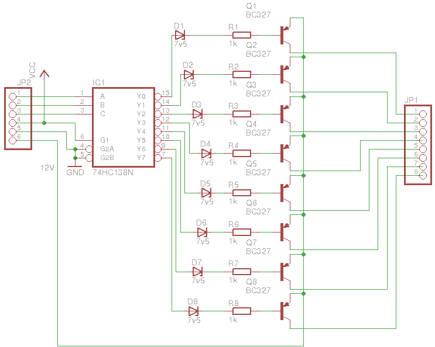

Color Image Budapest 8 by 8 LED display driver
==============================================

Building and burning the firmware
---------------------------------

Dependencies: `make` `gcc-avr` `avrdude`

	make program

If you haven't changed the clock settings to 8 MHz and no clock divider,
you'll also need to run `make burn-fuse`

Protocol
--------

One-way communication is done in 1 byte serial (USART) packets @ 9600 bps:

	(MSB) RRRS PPPP (LSB)

 - 3 bits for row selection (0-7, 0 is the topmost)
 - 1 bit for side selection (0 is left, 1 is right)
 - 4 bits pixel payload (LSB is the rightmost)

### Examples ###

(dots represent unchanged pixels)

Packet: `01001011` (0x4b)

Display:

	. . . . . . . .
	. . . . . . . .
	. . . . . . . .
	. . . . . . . .
	x   x x . . . .
	. . . . . . . .
	. . . . . . . .
	. . . . . . . .

Packet: `11111111` (0xff)

Display:

	. . . . . . . .
	. . . . . . . .
	. . . . . . . .
	. . . . . . . .
	. . . . . . . .
	. . . . . . . .
	. . . . . . . .
	. . . . x x x x

Controller board
----------------

 - ATtiny2313 microcontroller running at 8 MHz (internal clock)
   - PORT B (PB0-PB7) for column addressing
   - PORT D (PD2-PD5) for row addressing
 - 74HC138 3 to 8-line demux (row selection)
 - Darlington arrays for driving
   - UDN2873A 8 channel source driver for rows
   - ULN2003A 7 channel sink for columns + 1 transistor for 8th

### Schematics ###

Display board layout
--------------------

 - 5 LEDs are in series for each pixel
 - rows are numbered from top to bottom
 - cols are numbered from right to left
 - `right` and `left` are referred to as when looking at the LEDs
 - row pins must be positive, col pins must be grounded for LEDs to light

ASCII art layout:

	.------------------------------.
	|        COLOR  IMAGE    (TOP) |
	|          BUDAPEST            |
	|                              |
	|          ++++++++ (row pins) |
	|                              |
	|                              |
	|                              |
	|                              |
	|          ........ (blank)    |
	|                              |
	|                              |
	|          ++++++++ (col pins) |
	|                              |
	| (RIGHT)   (back)      (LEFT) |
	'------------------------------'
